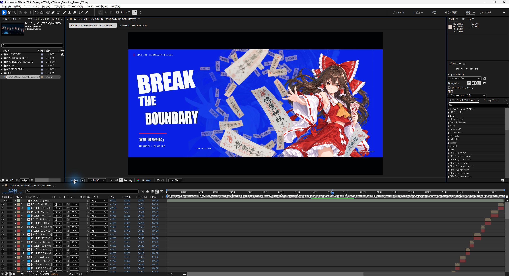
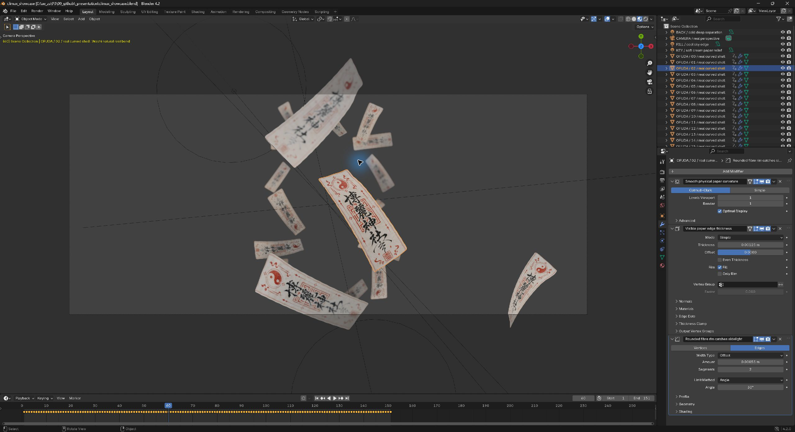

# AE / Blender 逐帧视觉复刻

把参考视频中的短帧节奏、UI、MG、人物演出和空间运动，转化为可继续编辑的 After Effects 工程与 Blender 场景。这是从一次东方 Project 主题改编和多轮返修中整理出的 **Codex skill**，包含制作方法、辅助脚本和验收流程。

**Frame-by-frame motion recreation for editable After Effects projects and Blender scenes.** Includes reference analysis, short-frame animation, curved paper depth passes, and render verification.

[下载 v1.0.0](https://github.com/EGSECDA/ae-blender-frame-recreation/releases/tag/v1.0.0) · [Skill 入口](SKILL.md) · [完整工作流](docs/workflow.md) · [六张应用截图与制作说明](docs/screenshots.md)

## 能做什么

| 工作 | 实现方式 |
|---|---|
| 参考逐帧拆解 | 提取全部帧和时间戳，记录 1–6 帧的入场、冲击、倒色、模糊与退出事件 |
| 主题改编与素材制作 | 图像模型生成角色、环境和纹理；构图、字体和色彩围绕新主题重新设计 |
| 可编辑 UI 与 MG | AE 原生文字、形状、蒙版、预合成、关键帧和效果 |
| 多人物对话 | 固定左右站位，发言角色保持彩色，非发言角色灰阶；分别控制动作 |
| 人物窗口 | 外部固定裁切框与内部人物运动分开，连续检查脸和动作是否出框 |
| 三维文字 | 文字与底片先组成完整字卡，再作为三维面参与透视运动 |
| 真实空间演出 | Blender 建模、相机、曲面纸张、厚度、材质与景深；透明序列导入 AE |
| 版本验收 | 原生渲染、连续帧比较、素材与帧数核对、最终视频和音轨完整解码 |

Skill 提供工作方法和可复用工具。每个项目仍需结合参考、素材和实际输出进行设计与审核。

## 实际制作界面

下面是制作案例的原生应用截图，用来说明工程形态。仓库不包含该案例的完整影片、原参考音乐或完整素材库；下载脚本不会自动生成截图中的整部作品。

### After Effects



案例主合成的 33.8 秒处：标题在左、人物在右，前景大符纸带景深模糊，中景保留纹理，背景叠加淡化幻影。总合成下方保留各段镜头。另见[短帧冲击与文字分层、双人对话截图](docs/screenshots.md)。

### Blender



案例的 19 张三维曲面符纸，在固定相机前沿纵深运动，结合景深形成前后层次。纸张保留细分、厚度和倒角修改器；[图解](docs/screenshots.md)中还展示网格细节与动画通道。包内另有便于独立运行的最小纸张演示。

## 安装到 Codex

1. 在 [v1.0.0 Release](https://github.com/EGSECDA/ae-blender-frame-recreation/releases/tag/v1.0.0) 下载 `ae-blender-frame-recreation.zip`。仓库和下载附件均公开可访问。
2. 解压后，将整个 `ae-blender-frame-recreation` 文件夹放入 Codex 的 `skills` 目录：已设置 `CODEX_HOME` 时使用其下的 `skills`；未设置时使用用户目录下的 `.codex/skills`。
3. 确认目录结构是 `skills/ae-blender-frame-recreation/SKILL.md`，避免多套一层同名文件夹。已有安装先保留副本，再替换。
4. 在新的 Codex 任务中用 `$ae-blender-frame-recreation` 明确调用，并提供参考视频、项目位置和目标要求。

Release 同时提供 `.skill` 与 `.zip`：两者使用相同的 ZIP 内容。手动解压安装时使用 `.zip` 即可。仓库根目录也包含完整 skill 源文件，GitHub 展示文档和截图不属于必需的运行资源。

## 调用示例

```text
使用 $ae-blender-frame-recreation 分析我提供的参考视频，
把主题改成东方 Project，保留参考中的短帧节奏和复杂 UI 演出。
角色和场景图片使用图像模型生成，真实三维场景与运镜用 Blender 制作，
最终交付可编辑 AE 工程、Blender 源文件、素材和成片。
所有文件整理到我指定的项目目录，每个阶段按连续帧自查。
```

已有工程也可以局部返修：

```text
使用 $ae-blender-frame-recreation 检查现有 AE 工程。
重点修复人物出框、文字遮脸和对话站位；灵梦左、魔理沙右，
不说话的角色变为灰阶。高潮先聚成规则符纸阵，再用几帧爆散，
随后慢漂；前景符纸需要纸面纹理、弯曲轮廓和景深。
请核对参考与新渲染的连续帧，并记录修改和验证范围。
```

## 依赖与连接方式

| 组件 | 用途与要求 |
|---|---|
| Codex | 读取 skill 并组织制作；需要本机文件与进程访问能力 |
| After Effects | 本机已安装并可运行；案例使用 AE 2025。JSX 按 ExtendScript / ES3 编写，具体效果和输出模板需现场确认 |
| Blender | 演示脚本面向 Blender 4.2+，实际小样使用 Blender 4.2 验证；通过 Blender 内置 `bpy` 运行 |
| Python | `frame_review.py` 需要 Python 3.9+ 与 Pillow 9.1+ |
| FFmpeg | `ffmpeg` 与 `ffprobe` 需要在 PATH 中，用于提帧、差异资料和解码验收 |
| 图像模型 | 创建正式角色、环境和材质时需要可用的图像生成能力；纸张技术演示可不使用外部图片 |

**这套流程没有依赖专用的 AE 或 Blender MCP。** AE 通过 JSX / ExtendScript 修改原生工程，`AfterFX.com` 启动脚本，`aerender.exe` 渲染；Blender 通过命令行运行 Python / `bpy`。两者以约定好尺寸、帧率、帧编号和 Alpha 的图像序列衔接。窗口控制工具用于打开应用、查看工程和截图，具体可用工具由运行环境决定。

字体、第三方效果、应用可执行文件路径和渲染设备均需在目标机器确认。Skill 不安装应用，也不携带商业软件或字体。

## 先运行一个小样

以下命令在仓库根目录运行。`python`、`blender`、`ffmpeg` 和 `ffprobe` 应能从命令行找到；也可使用本机确认过的可执行文件路径。

```sh
python -m pip install "Pillow>=9.1"
python scripts/frame_review.py extract reference.mp4 review/reference
python scripts/frame_review.py verify delivery.mp4 --report review/delivery-decode.json
```

`reference.mp4` 与 `delivery.mp4` 指向你自己的输入和输出。提帧目录必须为空或不存在；`verify` 检查解码与音轨信息，视觉质量和音画同步仍需观看与试听。

生成 72 帧的纸张场景，并先渲染三帧：

```sh
blender --background --factory-startup --python-exit-code 1 --python scripts/blender_paper_demo.py -- --output-dir ./work/paper-demo --fps 30 --frames 72 --burst-frame 28 --render-frames 18,31,48 --resolution-percent 25
```

输出包含 `paper_demo.blend`、透明 PNG 和审核 manifest。不传 `--texture` 时使用程序生成的技术占位纸面；正式作品应替换为契合题材的纹理。完整参数和 AE 库的使用方式见 [工作流说明](docs/workflow.md)。

## 仓库内容

```text
SKILL.md                         Codex 工作入口
agents/openai.yaml               技能名称、描述与默认提示
assets/example_timeline.json     整数帧分镜示例
scripts/frame_review.py         连续提帧、版本比较、完整解码
scripts/ae_primitives.jsx       AE 关键帧与人物窗口辅助库
scripts/blender_paper_demo.py   可编辑三维曲面纸张演示
references/                    AE、Blender、设计、审核与交付经验
docs/workflow.md                从参考到交付的操作说明
docs/screenshots.md             六张应用截图与对应制作说明
docs/images/                    实际应用截图
```

## 已验证的范围

- Skill 格式、文档内部链接、Python 语法及示例分镜结构已检查。
- 逐帧工具实际测试过连续提帧、VFR 时间戳、单像素变化、范围外变化、完整性异常、音轨解码和损坏视频；另做过 24 fps 参考与 30 fps 输出的独立使用测试。
- AE 库通过 ES3 解析和 16 项 mock / 纯函数测试。**新库的独立原生 AE 测试未执行成功**：宿主在启动阶段发生 GPU 初始化错误，尚未运行测试合成。这些测试不能替代目标机器上的 AE 小合成与实际渲染。
- Blender 4.2 已实际渲染并查看三帧小样，检查 16-bit RGBA、曲面、材质与景深，并检查该小样的全时间轴几何投影。Alpha 审查只覆盖渲出的三帧，保护区中极弱的模糊尾迹也被记录；这不等于整段交付审核通过。

制作案例截图与通用脚本的测试范围分别记录。最终项目仍应完成全部必要连续帧审核及正常速度播放检查。

公开前的文件、提交元数据、截图与下载附件检查，见[公开检查记录](docs/publication-check.md)。
