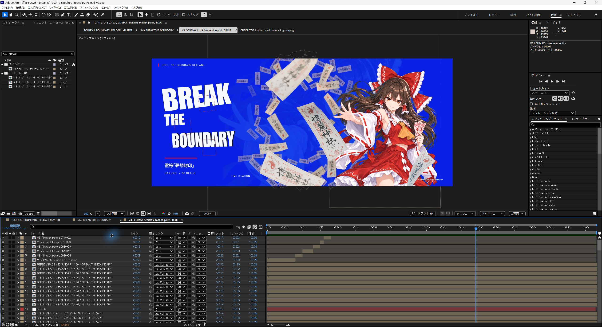
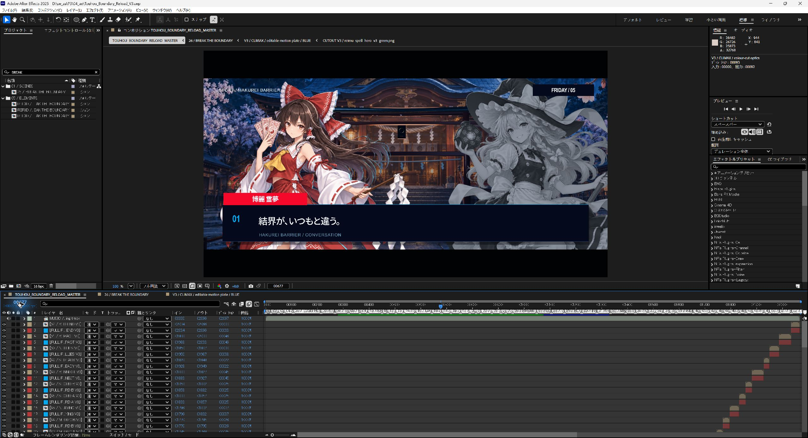
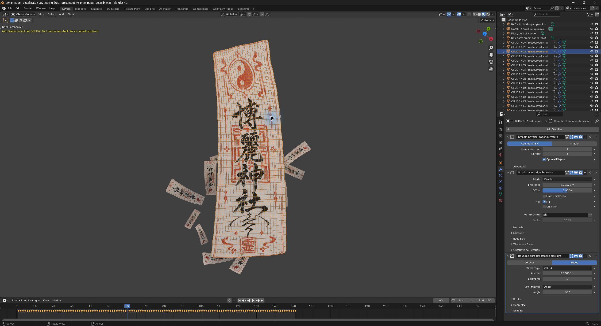
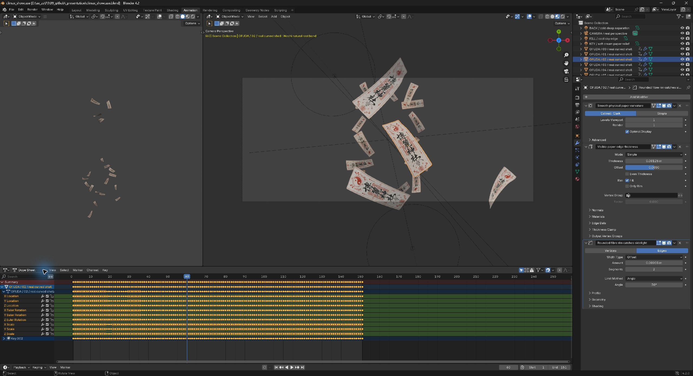

# 实际应用截图与制作说明

[返回首页](../README.md) · [完整工作流](workflow.md)

以下六张图片于 2026-09-11 从实际运行的 After Effects 2025 和 Blender 4.2 窗口采集，保留原始界面，未重绘或合成。AE 打开的是本次案例的 V3 工程；Blender 使用同一符纸场景的展示副本，只整理视图与工作区，模型、材质、相机和动画保持原场景内容。

截图用于解释制作结构；几帧内发生的动画仍需连续帧和正常速度播放确认。完整案例工程、角色原图、参考影片与音乐没有包含在这个 skill 仓库中。

## 1. AE 总合成：前景纸张、主体与背景幻影

画面位于主合成第 1014 帧，即 30 fps 下的 33.8 秒。标题位于左侧，灵梦位于右侧；靠近镜头的大符纸出现明显失焦，中景纸面保持可辨纹理，远处小符纸和淡化人物幻影提供背景层次。

设计时先给脸、关键动作与标题留出空间，再安排符纸的路径、尺寸与遮挡关系。主合成下方的分段图层保留整体剪辑结构，便于局部返修。对应方法见[视觉设计](../references/visual-direction.md)和[Blender 空间层次](../references/blender-depth.md)。

## 2. AE 子合成：短帧冲击与可编辑文字

打开高潮内部的 `V3 / CLIMAX / editable motion plate / BLUE` 子合成，显示局部第 59 帧，对应上图主合成第 1014 帧。顶部几个很短的图层是冲击帧片段；下方 `REF3D / FACE / ...` 图层保留文字面的分层结构及三维开关。

这里的文字通过 AE 三维图层叠层构成厚度和透视，仍能继续调整；截图不代表使用了 Blender 挤出文字。复用时应按镜头需要选择 AE 字卡或真正的三维挤出模型。只看这一张静帧不能判断冲击节奏，必须检查事件前后的全部帧。对应方法见[AE 工程组织](../references/ae-engineering.md)与[逐帧审核](../references/frame-review.md)。

## 3. AE 双人对话：用颜色区分发言状态

主合成第 677 帧，时间码为 `00:00:22:17`。灵梦固定在左侧并保持彩色，右侧魔理沙以灰阶显示；下方姓名条、编号与正文形成清晰的阅读顺序。发言状态改变时切换各自的颜色和强调程度，人物站位持续保留。

人物动作与对话框分别控制，避免换人时画面突然只剩一个角色。角色窗口应采用外部固定裁切、内部动画的结构，持续检查头部和手部是否超出预定区域。相关辅助函数见 [ae_primitives.jsx](../scripts/ae_primitives.jsx)。

## 4. Blender 场景：在真实纵深中安排符纸

场景共 19 张曲面符纸，分为 4 张前景纸与 15 张中景纸；案例中另外 90 张远景符纸由 AE 组织。此处 Blender 第 60 帧对应 AE 高潮局部第 59 帧，即主合成 33.8 秒，体现了 Blender 从 1 起算、此段 AE 从 0 起算的映射。

本段使用固定的 50 mm 透视相机，以便和 AE 构图对齐。纸张沿真实 Z 轴运动，并配合随时间变化的对焦距离和 f/1.8 景深。输出 16-bit RGBA 序列后叠入 AE，统一主题色和文字演出。相机位移可用于其他镜头，本段的空间感主要来自纸张运动与景深。

## 5. Blender 纸张细节：曲面、厚度与边缘

所选 `OFUDA / 02 / real curved shell` 显示纸面纹理与弯曲网格。基础网格为 559 个顶点、504 个四边面；右侧保留 Subdivision Surface、Solidify 和 Bevel 修改器，分别处理平滑曲面、薄纸厚度和边缘反光。截图中的厚度为 0.00125 m，倒角宽度为 0.00055 m。

纸面结合生成的和纸纹理、符咒印刷和凹凸细节。让轮廓弯曲、背面有区别、边缘能接光，近景纸张才有物体感。该案例采用形态键和关键帧控制卷曲，没有使用布料模拟。可独立运行的简化示例见 [blender_paper_demo.py](../scripts/blender_paper_demo.py)，其技术占位纹理与案例正式纹理不同。

## 6. Blender 动画通道：可检查的逐帧运动

Animation 工作区同时显示空间总览、相机视图和 Dope Sheet。底部展开所选符纸的位置、旋转、缩放与形态键通道；密集的键点来自按帧记录的动画。当前仍是第 60 帧，能与前述 AE 画面对照。

这类演出需要先确定聚拢、几帧爆散、慢速漂浮三个阶段，再检查速度变化和前后遮挡。键点多不等于运动流畅，应使用[逐帧工具](../scripts/frame_review.py)提取实际渲染，并检查每个短事件及其前后余量。

## 截图与验证的边界

这些截图确认案例能够在原生应用中打开，并展示当前工程状态。包内新整理的通用脚本有各自的验证记录，具体见[已验证的范围](../README.md#已验证的范围)；案例截图不能替代新脚本的原生宿主测试，也不能作为整部影片逐帧审核通过的证明。
